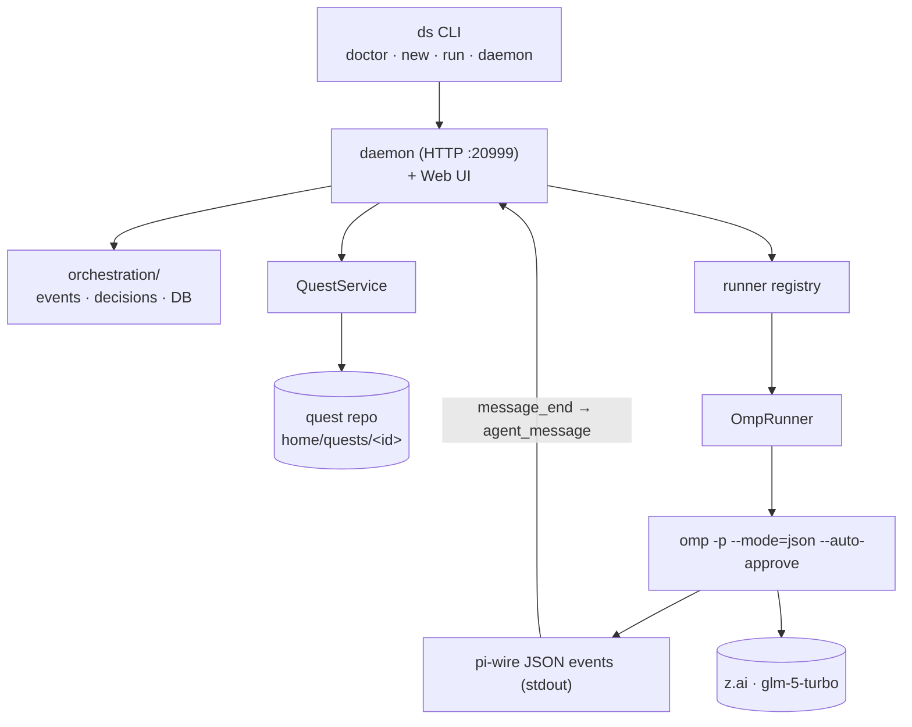

# 01 — Mental model

Three layers, strictly separated:

1. **Framework** (`src/deepscientist`, this repo): the daemon, CLI (`ds`),
   orchestration engine, runners, prompts, skills, docs. You develop *it*
   here; you never run research *in* here.
2. **DS home** (`/root/DeepScientist` by default, or any `--home`): the
   mutable runtime root — `config/*.yaml`, `runners.yaml` (model + API env),
   `logs/`, `memory/`, and `quests/`.
3. **Runners & providers**: the daemon spawns a runner CLI (omp by default),
   which talks to an LLM API (z.ai coding plan).

Key facts an agent must internalize:

- **One quest = one git repository**, created under the DS home by the
  framework. That's where projects live.
- The runner contract is **pi-wire JSON on stdout** (`-p --mode=json`).
  The CLI flag surface of omp drifts (see
  [troubleshooting](07-troubleshooting.md)); the event protocol is versioned
  (`"version": 3`) and is the stable thing to rely on.
- The **database is the source of truth** for orchestration state, never
  in-memory assumptions.
- Human takeover is always possible: pause quest, edit plan/code, resume.

Next: [02 — first run](02-first-run.md).
