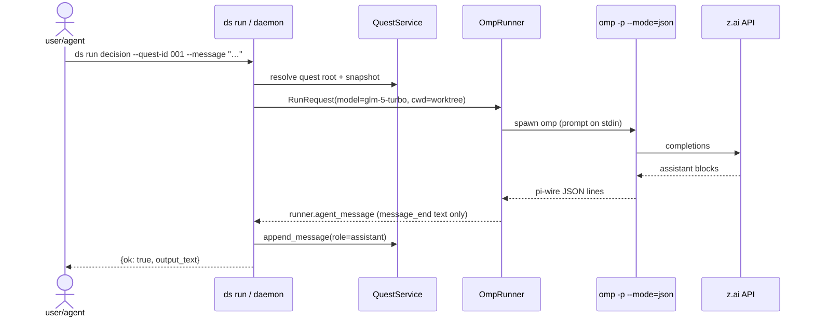

# 03 — Quest lifecycle (what actually happens on `ds run`)

## Event translation rules (pi-wire → runner events)

| pi-wire event | Runner event | Notes |
|---|---|---|
| `message_end` (role=assistant) | `runner.agent_message` | Only source of final text |
| `message_start` / `message_update` | — ignored | Partials; would duplicate |
| `message_end` (role=user) | — ignored | Echo of the prompt |
| `session` (version) | — ignored | Handshake metadata |
| `tool_call`-ish payloads | `runner.tool_call` | Legacy paths kept |

Rule of thumb: **emit once, from `message_end`**. Thinking blocks are not
forwarded as text.

## Long runs

A real research quest is not one `ds run`: the daemon keeps the loop
(baselines → experiments → analysis → writing), the quest repo accumulates
branches/worktrees, and `Findings Memory` + the Research Map carry state
across rounds. Pause/take over/resume at any time; every step is auditable
in the quest repo and the orchestration DB.

Next: [04 — layout & separation](04-layout-and-separation.md).
