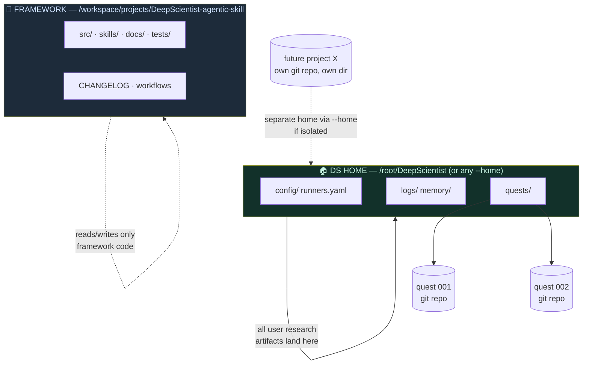

# 04 — Layout & separation (the non-interference contract)

**This repository is a framework. Research projects must never live inside
it.** The framework builds the lab; the lab never becomes the experiment.

## The three territories



## Hard rules

1. **Never create project content inside the framework checkout.** No
   experiment outputs, no datasets, no papers, no scratch repos under this
   tree. The only things committed here are framework code/docs/tests.
2. **Quests are created by the framework, under the DS home**
   (`ds new …` → `<home>/quests/00N`, each a real git repository). That is
   the sanctioned home for research projects.
3. **Need a fully isolated project?** Give it its own DS home:
   ```bash
   uv run ds --home /root/DeepScientist-projectX new "project X"
   ```
   Separate home = separate config, quests, memory, logs — zero shared
   mutable state with the main install, zero contact with the framework
   repo.
4. **Never point a quest's runner `--cwd` at the framework checkout.** The
   runner gets the quest worktree as cwd, always. Framework files are
   read-only from a quest's perspective.
5. **Framework development and research execution are different sessions.**
   Developing = edit here + GitOps PR flow. Researching = daemon + quests in
   the home. Don't mix the two in one working directory.
6. **Logs/state are never in `/tmp`.** `/tmp` is ephemeral (rootfs recycles
   wipe it — a verified incident). Continuous artifacts belong in the DS
   home (`<home>/logs/`), `/workspace`, or `/root`.

## Why this matters

- The framework stays **mergeable with upstream** — quest junk in the tree
  means permanent merge conflicts.
- Quests stay **portable and auditable** — each is a self-contained git
  repo you can push, archive, or hand to a colleague.
- The doctor/CI signal stays clean: a failing test means framework bug,
  not research collateral.

Next: [05 — model policy](05-model-policy.md).
