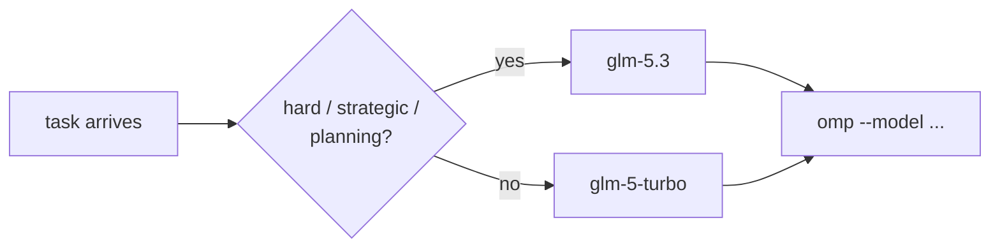

# 05 — Model policy (z.ai coding plan)

Current wiring (validated 2026-08-20):

| Setting | Value | Where |
|---|---|---|
| Provider | z.ai coding plan (OpenAI-compatible) | `ZAI_BASE_URL=https://api.z.ai/api/coding/paas/v4` |
| Key | `ZAI_API_KEY` | env **or** `runners.yaml` → `omp.env` |
| Default model | `glm-5-turbo` | `runners.yaml` → `omp.model` |
| Hard/strategic model | `glm-5.3` | per-run `--model glm-5.3` |

## Selection rule (user mandate)

- **`glm-5-turbo`** for everyday quest turns: fast, cheap, 200K context.
- **`glm-5.3`** when the task is **hard, strategic, or planning** —
  architecture decisions, research planning, deep analysis, complex
  debugging. (1M context, low/high/max thinking tiers.)



## Applying it

```bash
# default turn (turbo):
uv run ds run decision --quest-id 001 --message "..."
# hard/strategic turn:
uv run ds run decision --quest-id 001 --model glm-5.3 --message "plan the experiment matrix"
```

Catalog check: `ZAI_API_KEY=… omp models` (lists context/thinking/images
per model). Keep the key out of shell history and committed files when
possible; `runners.yaml` in the DS home is the sanctioned storage.

Next: [06 — GitOps](06-gitops.md).
