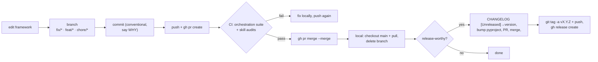

# 06 — GitOps (how changes ship)

Framework changes go through PRs. No direct pushes to `main`.

## Conventions in force (validated on PRs #11/#12, tag v1.7.0)

- Branch names: `fix/…`, `feat/…`, `chore/…`.
- Commit format: `type(scope): summary` + body explaining the why and the
  validation evidence.
- CI must be green on the PR before merge (`gh pr checks`).
- Releases: add/extend `CHANGELOG.md` (Keep a Changelog), bump
  `pyproject.toml`, merge via PR, then annotated tag + GitHub release.
- Local `main` is synced after every merge; feature branches are deleted.

## What is versioned

Only the **framework** (code, skills, docs, tests). Quests version
themselves in their own repos — never tag the framework for research
milestones.

Next: [07 — troubleshooting](07-troubleshooting.md).
