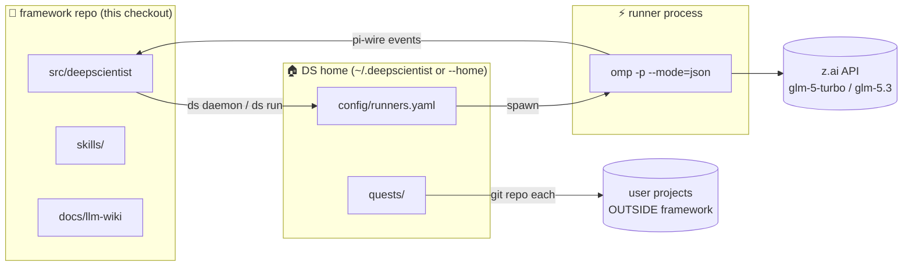

# DeepScientist LLM Wiki

Agent-facing operational wiki. Written for the LLM (or human) that has to
**use** this framework correctly on a Linux box: run quests, pick models,
keep the framework clean, and not shoot yourself in the foot.

> Rule zero: **this repository is the framework.** Research projects never
> live inside it. See [04 — Layout & Separation](04-layout-and-separation.md).

## Pages

| # | Page | What it covers |
|---|------|----------------|
| 1 | [Mental model](01-mental-model.md) | Components and how they talk (diagram) |
| 2 | [First run](02-first-run.md) | doctor → daemon → first quest, verified |
| 3 | [Quest lifecycle](03-quest-lifecycle.md) | What happens on `ds run` (sequence diagram) |
| 4 | [Layout & separation](04-layout-and-separation.md) | Framework vs DS home vs quests — the non-interference contract |
| 5 | [Model policy](05-model-policy.md) | glm-5-turbo default · glm-5.3 for hard/strategic · z.ai wiring |
| 6 | [GitOps](06-gitops.md) | branch → PR → CI → merge → tag → release |
| 7 | [Troubleshooting](07-troubleshooting.md) | Real incidents and their fixes (proot/bun, omp flag drift, …) |

Companion skill (agent runtime): [`skills/deepscientist-usage/`](../../skills/deepscientist-usage/SKILL.md).
Setup/repair skill: [`skills/deepscientist-linux-agent-setup/`](../../skills/deepscientist-linux-agent-setup/SKILL.md).

## The whole system in one picture

Everything inside `FRAMEWORK` is product code. Everything the user creates
(quests, papers, experiments, artifacts) lands in `HOME` — never back into
the framework checkout.
